# Voice Journal Therapy - System Architecture Flowchart

## Simplified Flow (Quick Overview)

This is a high-level view of how the system works - perfect for understanding the basics.

```mermaid
flowchart LR
    User["👤 User<br/>Speaks"] --> Mic["🎤 Microphone<br/>Captures Audio"]
    Mic --> VAD["🔊 Voice Detection<br/>Detects Silence"]
    VAD --> STT["🎙️ ElevenLabs<br/>Speech → Text"]
    STT --> Parallel{"⚡ Parallel Processing<br/>(Promise.all)"}
    Parallel --> Crisis["🚨 Crisis Check<br/>Gemini AI"]
    Parallel --> AI["🧠 Gemini AI<br/>Generates Response"]
    Crisis --> Merge["Merge Results"]
    AI --> Merge
    Merge --> TTS["🔊 ElevenLabs<br/>Text → Speech"]
    TTS --> Speaker["🔊 Speaker<br/>Plays Response"]
    Speaker --> User

    style User fill:#e1f5ff,stroke:#01579b,stroke-width:2px
    style Mic fill:#f3e5f5,stroke:#4a148c,stroke-width:2px
    style VAD fill:#f3e5f5,stroke:#4a148c,stroke-width:2px
    style STT fill:#e8f5e9,stroke:#1b5e20,stroke-width:2px
    style Parallel fill:#fff9c4,stroke:#f57f17,stroke-width:3px
    style Crisis fill:#ffebee,stroke:#b71c1c,stroke-width:2px
    style AI fill:#e8f5e9,stroke:#1b5e20,stroke-width:2px
    style Merge fill:#fff9c4,stroke:#f57f17,stroke-width:2px
    style TTS fill:#e8f5e9,stroke:#1b5e20,stroke-width:2px
    style Speaker fill:#f3e5f5,stroke:#4a148c,stroke-width:2px
```

**How it works:**
1. **User speaks** into their device microphone
2. **Voice Activity Detection** waits for silence (1.5 seconds)
3. **ElevenLabs STT** converts speech to text
4. **Parallel Processing** runs simultaneously:
   - **Crisis Detection** analyzes conversation for safety concerns
   - **Gemini AI** generates an empathetic response
5. **ElevenLabs TTS** converts response to natural speech
6. **Audio plays back** to the user
7. **Loop continues** automatically for continuous conversation

**Key Technologies:**
- 🎙️ **ElevenLabs**: Voice input/output (STT + TTS)
- 🧠 **Google Gemini 2.5 Flash**: AI reasoning and crisis detection
- 🔊 **Web Audio API**: Real-time voice activity detection
- 💾 **Supabase**: User data and conversation storage

**Performance Optimization:**
- ⚡ **Parallel Processing**: Crisis detection and AI response generation run simultaneously using `Promise.all()`, reducing response time by ~50%

---

## Complete System Flow

## State Transition Diagram

## Component Interaction Sequence

## Data Flow Architecture

```mermaid
flowchart LR
    subgraph Input["📥 Input Layer"]
        Microphone["Microphone<br/>(MediaStream)"]
    end

    subgraph Processing["⚙️ Processing Layer"]
        Capture["Audio Capture<br/>(MediaRecorder)"]
        VAD_Proc["VAD<br/>(Real-time analysis)"]
        Conversion["WAV Conversion"]
    end

    subgraph AI["🤖 AI Services"]
        ElevenLabs_STT["ElevenLabs STT<br/>(Speech → Text)"]
        CrisisDetect["Crisis Detection<br/>(Gemini 2.5 Flash)"]
        Gemini["Gemini 2.5 Flash<br/>(Text → Response)"]
        ElevenLabs_TTS["ElevenLabs TTS<br/>(Text → Speech)"]
    end

    subgraph Output["📤 Output Layer"]
        AudioOut["Audio Playback<br/>(Web Audio API)"]
        UI_Display["UI Display<br/>(Conversation)"]
    end

    subgraph Storage["💾 Storage Layer"]
        LocalStorage_Data["localStorage<br/>(Conversation State)"]
        Cache["Response Cache<br/>(Deduplication)"]
    end

    Microphone --> Capture
    Capture --> VAD_Proc
    VAD_Proc --> Conversion
    Conversion --> ElevenLabs_STT
    ElevenLabs_STT --> CrisisDetect
    CrisisDetect --> Gemini
    Gemini --> ElevenLabs_TTS
    ElevenLabs_TTS --> AudioOut
    ElevenLabs_STT --> UI_Display
    Gemini --> UI_Display
    UI_Display --> LocalStorage_Data
    Gemini --> Cache
    Cache --> Gemini
```

## Rate Limiting & Queue Management

